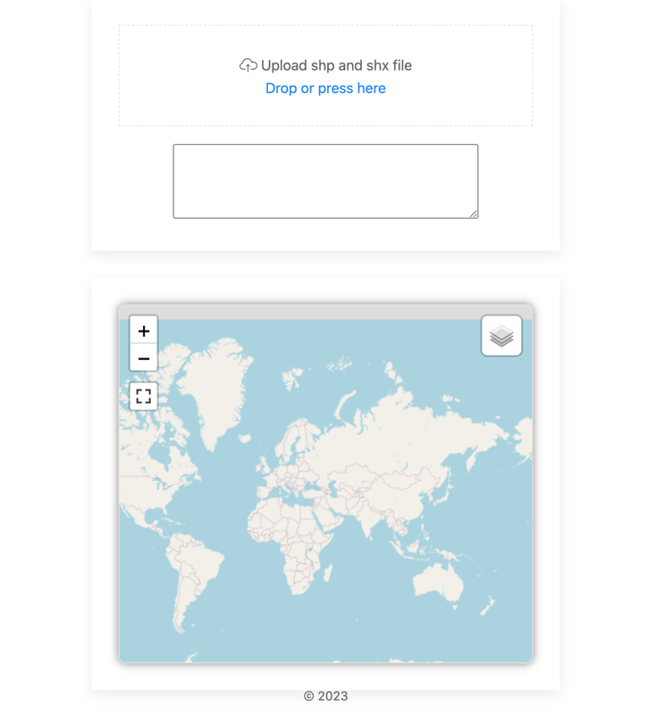
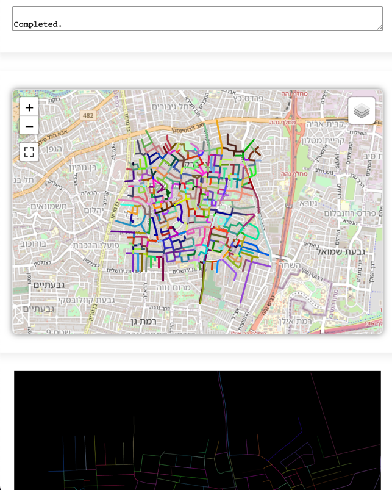
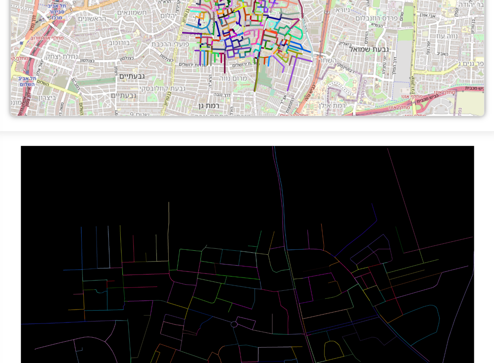

# Python test task (GIS)
#### Partial solution

## Explanation
The simplest street painting algorithm using python3 and a simple web server to which the user can attach a file to be processed. The algorithm should draw the lines in one color when you think it's one street.

### Notes
When merging street segments based on geometry and missing attributes, as in the test data, separating lanes from streets or identifying intersections and roundabouts can be challenging. 
Merging street segments based only on geometry can result in merging lines that shouldn't be merged, especially if the data contains roundabouts, intersections, or lanes.

In this simple project, the goal was not to do research and develop an optimal algorithm

One possible approach to solve this problem would be to use more complex geometric analyzes and heuristics to identify different types of road segments. For example:
- Using Geometric Features: You can analyze the length and shape of street segments to identify brief sections that could be lanes. You can also examine the shape of the line segments to identify roundabouts.
- Use of node density: Intersections usually have a high node density, as several streets intersect here. You can use cluster analysis to highlight high-density nodes and identify intersections.
- Consider traffic rules: Depending on the geographic context, your data may contain information about traffic rules and signs that can help identify types of road segments.
- Use of indirect data from related industries or open spatial databases, such as open-streetmap

### Simple algorithm
The approach used in the absence of attributes is the analysis of segment geometry. 
- Groups adjacent segments whose endpoints are close enough to each other to be considered part of the same street. 
- In addition check the intersection angle between adjacent segments

#### Default parameters
- distance_threshold=0.000001 degree
- angle_threshold=10 

## Requirements and Start running:
### macOS/Linux
- Create environment: python -m venv venv
- Activate: source venv/bin/activate
- Dependencies: pip install -r requirements.txt
- Start running: './run.sh'
- Open in browser http://localhost:999/

## Examples
#### Start screen.

#### After processing - Lines are randomly colourized. Geojson contains merged lines

#### Generated output, but lines have different line colors.
